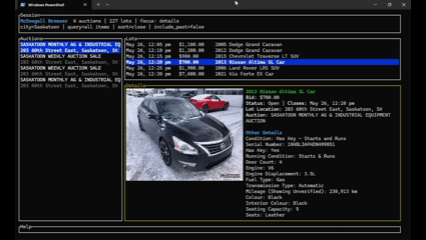

# mcdougs

A fast terminal browser for live [McDougall Auctioneers](https://www.mcdougallauction.com/) lots.

`mcdougs` opens to a keyboard-first TUI, filters Saskatoon auctions by default, keeps live bid and close data easy to scan, and shows the selected lot's first photo beside the useful listing details. It is built for quickly moving through auction lots without opening a browser until you actually want the bidding page.



## Features

- Browse matching auctions, lots, photos, bids, close times, and listing details in one terminal view.
- Defaults to Saskatoon and hides past lots unless requested.
- Opens the real auction lot page in your browser only when you click a lot/preview or press `o`.
- Hydrates details and preview images in the background, starting with the selected auction.
- Caches decoded previews and cleaned lot details locally until the lot close time passes.
- Uses terminal graphics when supported by the terminal, with a portable truecolor fallback.
- Builds direct Windows and Linux release binaries from `v*` git tags.

## Install

Download the latest binary from the public repo's releases:

https://github.com/pauljones0/mcdougs/releases

On Windows, run:

```powershell
.\mcdougs-v0.1.1-windows-x86_64.exe
```

On Linux, make the binary executable, then run it:

```bash
chmod +x ./mcdougs-v0.1.1-linux-x86_64
./mcdougs-v0.1.1-linux-x86_64
```

## Build From Source

Install Rust, then run:

```bash
cargo run --release
```

For a local release binary:

```bash
cargo build --release --locked
```

## Usage

The default startup is:

```bash
mcdougs
```

Useful options:

```bash
mcdougs --city Regina
mcdougs --query truck
mcdougs --sort price
mcdougs --include-past
mcdougs --plain
```

Defaults:

- `--city Saskatoon`
- `--sort close`
- past lots hidden
- TUI mode enabled

## Controls

- `Left` / `Right`: move between auctions, lots, and details.
- `Up` / `Down` or `j` / `k`: move through auctions/lots, or scroll details when details has focus.
- `Up` at the top of details: return to lots.
- `Enter`: move into the selected pane.
- `o`: open the selected lot's bidding page in your browser.
- Click a lot row or preview photo: open the selected lot's bidding page.
- Mouse wheel over details: focus and scroll details.
- Drag highlighted pane borders: resize auctions, lots, and details.
- `Backspace` or `Esc`: move back one pane. `Esc` from auctions quits.
- `r`: refresh live auction data.
- `q`: quit.

## Image Modes

By default, `mcdougs` tries to use terminal graphics protocols such as Kitty, Sixel, or iTerm2 when available. If your terminal does not support those, it uses portable truecolor rendering.

Override the image mode with `MCDOUGS_IMAGE_MODE`:

```bash
MCDOUGS_IMAGE_MODE=auto mcdougs
MCDOUGS_IMAGE_MODE=fast mcdougs
MCDOUGS_IMAGE_MODE=off mcdougs
```

In PowerShell:

```powershell
$env:MCDOUGS_IMAGE_MODE = "auto"
.\mcdougs.exe
```

## Cache

Details and decoded photo previews are cached locally so revisiting lots is fast.

- Windows: `%LOCALAPPDATA%\mcdougs\cache`
- Linux/macOS-style environments: `~/.cache/mcdougs`

Cache entries are kept only while the lot close time is still in the future. Auction listing pages are still refreshed for live bid and close data.

## Development

```bash
cargo fmt
cargo test --locked
cargo clippy --locked -- -D warnings
```

Optional profiling:

```bash
MCDOUGS_PROFILE=mcdougs-profile.csv mcdougs
```

## Release

Pushing a tag that starts with `v` builds direct Windows and Linux x86_64 binaries and uploads them to a GitHub Release.

```bash
git tag -a v0.1.1 -m "Release v0.1.1"
git push origin main --follow-tags
```

Release assets are named like:

```text
mcdougs-v0.1.1-windows-x86_64.exe
mcdougs-v0.1.1-linux-x86_64
mcdougs-v0.1.1-linux-x86_64.tar.gz
```
